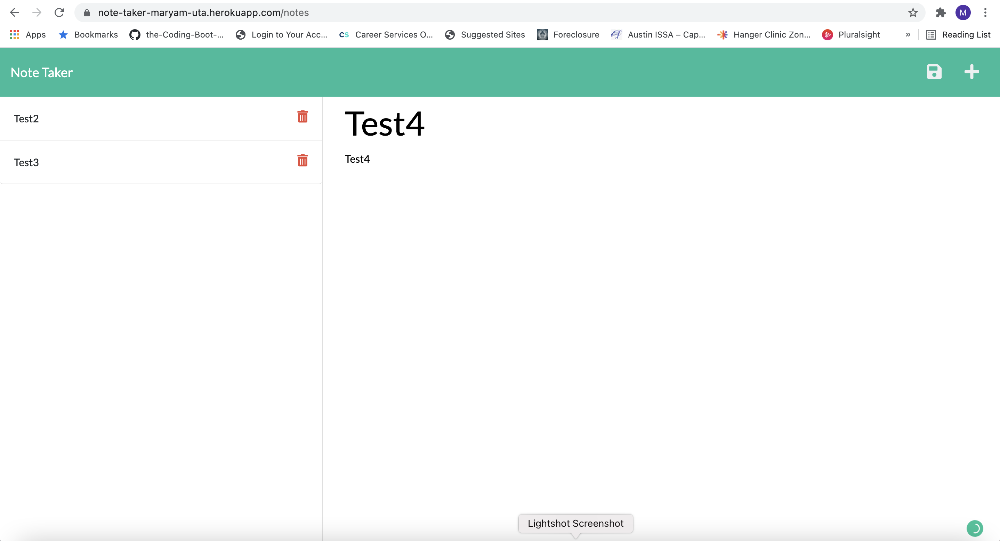

# note-taker

Acceptance criteria - GIVEN a note-taking application
WHEN I open the Note Taker
THEN I am presented with a landing page with a link to a notes page
WHEN I click on the link to the notes page
THEN I am presented with a page with existing notes listed in the left-hand column, plus empty fields to enter a new note title and the note’s text in the right-hand column
WHEN I enter a new note title and the note’s text
THEN a Save icon appears in the navigation at the top of the page
WHEN I click on the Save icon
THEN the new note I have entered is saved and appears in the left-hand column with the other existing notes
WHEN I click on an existing note in the list in the left-hand column
THEN that note appears in the right-hand column
WHEN I click on the Write icon in the navigation at the top of the page
THEN I am presented with empty fields to enter a new note title and the note’s text in the right-hand column

## Description
This application is meant to assist the user in keeping track of their notes.  They can add and delete notes.  These notes are stored in the back-end in a json file.

## Heroku Deployed Link
https://note-taker-maryam-uta.herokuapp.com/

## GitHub Deployed Link
https://mguppy.github.io/note-taker/

## Questions
If you have any questions about the repo, open an issue or contact me directly at mguppy34@gmail.com. You can find more of my work at github.com/mguppy.

Credits: w3schools.com, my tutor, classmates and my programmer husband
